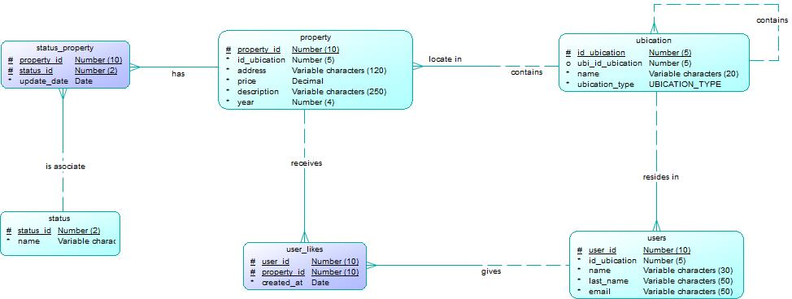

# Prueba Técnica Habi - Sebastián Felipe Fonseca Hurtado

## 1. Introducción

Este repositorio contiene la solución completa para la prueba técnica de Habi. El proyecto incluye los siguientes entregables:
* Un **API REST** funcional para la consulta de inmuebles, desarrollada en Python sin frameworks.
* Un **Algoritmo de Bloques** que resuelve el problema de los bloques de números.
* Un **Script de implementación BD** que resuelve el problema de los bloques de números.
* El **Modela Entidad/Relación** para un nuevo servicio de "Me gusta", incluyendo el diagrama E-R, el código SQL y la justificación del diseño.
* **Pruebas unitarias** para la lógica principal.

## 2. Tecnologías Utilizadas

* **Lenguaje**: Python 3.11
* **Base de Datos**: MySQL
### Librerías
* **`http.server`**: Utilizada para crear el servidor web básico desde cero, sin necesidad de frameworks.
* **`json`**: Para la codificación de los datos de respuesta del API al formato JSON.
* **`urllib.parse`**: Usada para analizar las URLs y extraer los filtros de búsqueda de las peticiones `GET`.
* **`decimal`**: Necesaria para manejar el tipo de dato `Decimal` de la base de datos y permitir su conversión a JSON.
* **`unittest`**: El framework estándar de Python para la creación y ejecución de pruebas unitarias, incluyendo `unittest.mock` para simular la conexión a la base de datos.
* **`mysql-connector-python`**: El conector que permite la comunicación entre la aplicación Python y la base de datos MySQL.


## 3. Cómo Ejecutar el Proyecto

### Prerrequisitos
* Tener instalado Python 3.
* Tener Git instalado.
* Una instancia de MySQL funcionando (local o remota).

### Instalación
1.  Clona el repositorio:
    ```bash
    git clone [https://github.com/Sebastian1392/Prueba-Tecnica-HABI.git](https://github.com/Sebastian1392/Prueba-Tecnica-HABI.git)
    cd Prueba-Tecnica-HABI
    ```
2.  Instala las dependencias:
    ```bash
    pip install -r requirements.txt
    ```
3.  Configura la base de datos local ejecutando los scripts SQL proporcionados.

### Ejecución
* **Para correr el API**:
    ```bash
    cd "1 Api"
    ```
    ```bash
    python main.py
    ```
    El servidor se iniciará en `http://localhost:8000`. Puedes hacer peticiones a `http://localhost:8000/properties`.

* **Para correr las Pruebas Unitarias del API**:
    ```bash
    cd "1 Api"
    python -m unittest
    ```

* **Para correr el Algoritmo de Bloques**:
   ```bash
    cd "2 Algorithm"
    python block_algorithm.py
    ```
* **Para correr las Pruebas Unitarias del Algoritmo**:
    ```bash
    cd "2 Algorithm"
    python -m unittest
    ```

## 4. Diseño del Servicio "Me Gusta"

### 4.1. Explicación del Diseño
Para implementar la funcionalidad de "Me gusta", se propone un diseño que extiende el modelo actual, garantizando la escalabilidad.

La solución se centra en la creación de una nueva tabla intermedia llamada **`user_likes`**. Esta tabla resuelve la relación **muchos a muchos** que existe entre los usuarios y las propiedades: un usuario puede dar "me gusta" a muchas propiedades, y una propiedad puede recibir "me gusta" de muchos usuarios.

Se incluye una columna **`created_at`** en la tabla `user_likes` para cumplir con el requisito de almacenar el **histórico de "me gusta"**, permitiendo realizar análisis futuros sobre la interacción de los usuarios.

### 4.2. Diagrama Entidad-Relación
El siguiente diagrama muestra el modelo de datos extendido con la implementación del servicio "Me Gusta" y con la optimización para mejorar la velocidad en las consultas:



### 4.3. Código SQL
El código SQL necesario para crear las nuevas tablas en la base de datos se encuentra en el archivo **[`ServicioMeGusta.sql`](./Scripts%20SQL/ServicioMeGusta.sql)**, en donde se asume la creación de una tabla `users` para almacenar la información de los usuarios registrados.

## 5. Propuesta de Optimización del Modelo

Para cumplir con el punto extra de proponer una mejora al modelo de datos, se añadió una entidad `ubication`. La razón principal es normalizar la base de datos para hacerla más eficiente, robusta y escalable. Esta decisión optimiza el sistema de tres maneras fundamentales:

* **Reducción de Redundancia y Tamaño**: En lugar de repetir el texto de la ciudad o el país en cada registro de `property` y `users`, solo se almacena un `id_ubication` (un número entero). El nombre "Bogotá" se guarda una sola vez, reduciendo drásticamente el espacio de almacenamiento.
* **Consultas Más Rápidas**: Las bases de datos son mucho más eficientes al buscar y unir tablas usando números enteros indexados que campos de texto. Filtrar por `id_ubication` es significativamente más rápido que buscar por `city_name = 'bogota'`. La estructura jerárquica (una ubicación dentro de otra) también permite búsquedas geográficas complejas de forma muy eficiente.
* **Integridad y Calidad de los Datos**: Se elimina la posibilidad de errores de tipeo ("Bogota" vs "bogota"). Al forzar una relación con la tabla `ubication`, se garantiza que los datos de ubicación sean consistentes y fiables en todo el sistema. Adicionalmente, se asocia a la tabla `users` para permitir futuras funcionalidades, como **mostrar al usuario propiedades de preferencia que estén en la misma ubicación donde reside**.

El Script con la propuesta se encuentra en el archivo **[`PropuestaOptimizacion.sql`](./Scripts%20SQL/PropuestaOptimizacion.sql)**.

## 6. Metodología y Decisiones Tomadas

### Dudas y Resoluciones

* **Duda**: Una duda inicial fue cómo la API debía recibir los filtros para la consulta de inmuebles. Se consideraron dos enfoques: aceptar un cuerpo JSON en una petición `POST` o usar parámetros de consulta en una petición `GET`.

* **Resolución**: Se decidió implementar la recepción de filtros a través de **parámetros de consulta en una petición `GET`** (ej. `?city=bogota&year=2020`). 

    Esta decisión se tomó porque es la convención estándar y la mejor práctica para las **APIs REST** cuando la operación es de **consulta o solicitud de datos**. Las peticiones `GET` son seguras (no modifican datos en el servidor) e idempotentes (se pueden realizar múltiples veces obteniendo el mismo resultado).

    Se concluyó que el archivo JSON solicitado en los requisitos era un **artefacto de documentación** para simular la estructura de datos que manejaría el front-end, y no el método de transmisión para la consulta. Sin embargo, se agrega cómo sería la estructura del JSON para la aplicación de los filtros:

    ```json
    {
      "city": "bogota",
      "year": 2022,
      "status": "en_venta"
    }
    ```

* **Duda**: Se presentó un problema de conexión persistente con la base de datos remota proporcionada, lo que impidió realizar las consultas del API.

* **Resolución**: Para poder completar la parte práctica del reto, se decidió **montar un entorno de base de datos local** utilizando MySQL. Se crearon los scripts SQL para generar un esquema que se infiere de los requisitos de la prueba, asumiendo la estructura de las tablas (`property`, `status`, `status_history`) y sus atributos. Los scripts para la creación e inserción de datos se encuentran en **[`CreateTables.sql`](./Scripts%20SQL/CreateTables.sql)** y **[`InsertData.sql`](./Scripts%20SQL/InsertData.sql)** en la carpeta **`Scripts SQL`** del repositorio para replicar de la prueba.
